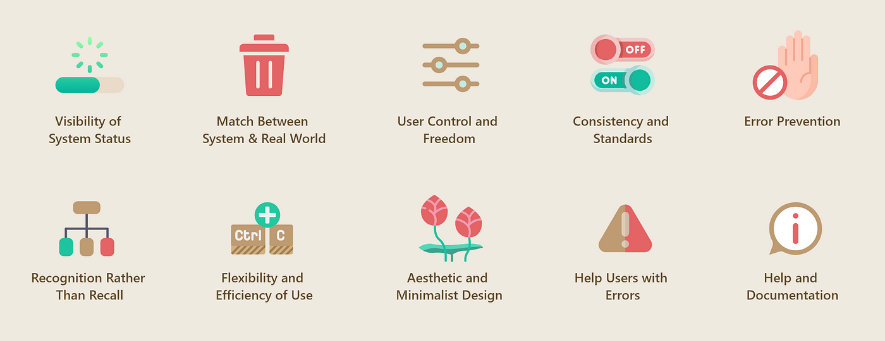

# Car Dashboard Design: Sunny
> "Een gezinsvriendelijk dashboard dat maximale veiligheid en minimale afleiding biedt met een heads-up display en intuïtieve bediening.
"

*Projectteam: luca Poppe; Noah Menschaert;*

*Datum 10/5/2024*

  

## Samenvatting
#### Het probleem:
- Hoe kunnen we een auto dashboard veiliger maken, rekening houdend met de behoeften van gezinnen?

#### Hoe hebben we dit onderzocht?
- Dit designproject is gebaseerd op meerdere interviews, een focusgroep met de doelgroep, bronnenonderzoek en benchmarking (zie bijlage).

#### Wat is onze oplossing?
Onze oplossing bestaat uit vier hoofdcomponenten:

- <ins>Heads-Up Display (HUD):</ins> De GPS-route wordt over het hele raam geprojecteerd via heldere en duidelijk zichtbare blauwe pijlen op de straat geprojecteerd. Dit zorgt ervoor dat de bestuurder zijn aandacht en zicht niet van de rijbaan hoeft af te halen om te controleren waar hij moet afslaan (zie onderstaande foto).
  

  

> HUD
- <ins>Voice Control:</ins> Alle functies worden voornamelijk bestuurd via spraakcommando's, vergelijkbaar met Google Assistent. Dit vermindert afleiding en zorgt voor een veiligere interactie met de auto.
  
  

  

https://youtu.be/4ao7_wawhSE 

> Voice activation
- <ins> Centraal Control Panel: </ins> Een touchscreen voor het invoeren van de GPS-bestemming. Dit paneel heeft een gepolariseerde film zodra de auto begint te rijden wordt deze over het scherm getrokken, hierdoor kan de bestuurder niet meer afgeleid worden tijdens het rijden. Dit omdat de film ervoor zorgt dat enkel de medepassagier nog naar het scherm kan kijken (zie onderstaande foto).
  
  

  

> Polaristiefilm interface 
  
- <ins>Draaiknoppen:</ins> Een knop met een intuitief gebruik dat blindelings bestuurd kan worden om de temperatuur, volume etc. kan besturen (zie onderstaande foto). 

  

  
     

> Een 3d print van 2 rotatie knoppen met klik die respectievelijk de temperatuur en het volume moeten besturen.

#### Hoe lost onze oplossing het probleem op?
Door de integratie van een HUD, voice control en een centraal control panel met gepolariseerde film als overlay tijdens het rijden, blijft de aandacht van de bestuurder op de weg gericht. Dit vermindert afleiding en verhoogt de veiligheid voor gezinnen tijdens het rijden

## Introductie
Zoals al eerder vermeld is, luidt het probleem als volgt: ”Hoe kunnen we ervoor zorgen dat een auto dashboard veiliger wordt en dat er rekening gehouden wordt met de doelgroep die deze auto zal gebruiken.” Hierin vind je al 2 van de belangrijkste eisen terug, namelijk dat het dashboard zo veilig mogelijk moet zijn en dat het ontworpen wordt voor een gezin, zijnde de doelgroep.

We gaan dus bij elke stap en keuze die we maken onze doelgroep moeten ondervragen en controleren of dit voor hen de beste oplossing is. Bij elke stap en keuze gaan we ook een check moeten doen of dit een veilige oplossing is voor het subprobleem/aspect.

Uit de doelgroep volgen dan ook verschillende sub eisen/wensen. Een van deze is bijvoorbeeld dat de dashboard er goed moet uitzien zodat het een aantrekkelijk product is om te gebruiken. Nog een paar van deze sub eisen/wensen zijn een eenvoudige bediening, een minimalistisch design met enkel essentiële knoppen. Deze eisen en wensen komen allemaal uit een interview dat wij gedaan hebben met de doelgroep.

Het project is in samenwerking met Granstudio een bedrijf dat al lang bezig is met het ontwerpen van nieuwe en innovatieve oplossingen voor interactieve producten en al veel bezig is geweest met onder andere automotive design, interactive design en mobility design (About | Granstudio, n.d.). Zij gebruiken digiphy om verschillende aspecten van het dashboard te testen en verwachten dat we een soortgelijke opstelling maken om ook verschillende aspecten te kunnen testen.
## Methodologie

  
     

- <ins>Literatuuronderzoek:</ins> We begonnen met een grondige studie van bestaande literatuur om ons te verdiepen in het onderwerp.
  
- <ins>Benchmarking:</ins> Vervolgens analyseerden we verschillende benchmarks, waarbij we de voor- en nadelen van bestaande technologieën in kaart brachten. Dit stelde ons in staat om te bepalen welke technologieën al beschikbaar en essentieel zijn.
 
- <ins>Interviews en Focusgroep:</ins> We voerden interviews en organiseerden een focusgroep om de leefstijl en behoeften van onze doelgroep te begrijpen. Dit hielp ons inzicht te krijgen in hun eisen en wensen voor het ontwerp van een auto dashboard.
  
- <ins>Probleemstelling en Wensen:</ins> Op basis van ons vooronderzoek stelden we een duidelijke probleemstelling en aanvullende wensen op. Dit gaf ons een helder beeld van de belangrijkste problemen die ons nieuwe auto dashboard moest oplossen.
  
- <ins>Brainstorming en Conceptontwikkeling:</ins> We brainstormden over verschillende oplossingen, waarbij we ons onderzoek als leidraad gebruikten (zie bijlagen). We pitchten elk een oplossing en werkten vervolgens verder aan één geselecteerde concept.
 
- <ins>Concept Validatie en Prototyping:</ins> In de concept validatie fase begonnen we met het maken van prototypes om verschillende deelaspecten van ons ontwerp te testen bij gebruikers. Dit stelde ons in staat om te evalueren wat werkt en om op basis van feedback iteraties uit te voeren.

## Discovery

### <ins> Doestellingen </ins>
De doelstelling in deze “discovery” fase was ons onderdompelen in het thema. Dus zo veel mogelijk info verzamelen zodat we veel kennis hebben over het onderwerp om hieruit oplossingen voor het probleem te zoeken en vinden. Vervolgens was het doel om een duidelijk probleem vast te leggen bij onze doelgroep met betrekking tot car dashboards. Zodat we hieruit exact wisten wat de eisen en wensen waren waarmee wij bij elke stap van het verdere ontwerpproces rekening moesten houden.

  

### <ins> Materiaal & Methoden </ins>

#### De gebruikte methoden waren:
-  Benchmarking 
-  Interviews met de doelgroep 
-  Focusgroep 
-  Bronnenonderzoek 

#### Benchmarking
We onderzochten verschillende auto's, zoals de Mazda RX-7, die bekend staat om zijn ergonomische dashboard. Een opvallend kenmerk is de schuine plaatsing van alle bedieningsoppervlakken richting de bestuurder, wat zorgt voor betere zichtbaarheid en toegankelijkheid van de bedieningselementen. Dit ontwerp wordt vaak vergeleken met een straaljagercockpit, wat de bestuurder een gevoel van volledige controle geeft.

> "The first thing you will notice is the slant to every control surface in the vehicle. Everything is tilted towards the driver, hugging him/her and giving better visibility and access to anything needed for driving. When you sit in the driver’s seat there is no doubt in your mind who is controlling the vehicle. Many describe it as getting into a fighter jet and I believe that is accurate."  
(What’s the Best Car Dashboards Ever Designed?, n.d.).

Daarnaast hebben we modernere auto's zoals de Tesla bekeken. De pro's van het Tesla-dashboard zijn:
- Slechts twee knoppen
- Minimalistisch design
- Weinig afleidingen

De nadelen van een centraal touchscreen zijn:
- Moeilijk te navigeren
- Niet altijd de beste respons
- Zeer afleidend

Andere benchmarks die we hebben onderzocht, zijn te vinden op ons Miroboard (zie bijlage).

#### Bronnenonderzoek
We lazen samen ongeveer twintig bronnen en noteerden de essentie ervan in onze Miroboards (zie bijlage).

#### Interviews
We interviewden mensen uit onze doelgroep om inzicht te krijgen in hun levensstijl en hun behoeften en wensen op het gebied van producten en autogebruik. Details van deze interviews zijn te vinden in de bijlagen.

#### Focusgroep
We observeerden een gezin tijdens een autorit waarbij een van ons aanwezig was. Het gezin werd gevraagd zich te gedragen alsof het een normale rit was. Dit gaf ons de kans om het gedrag van een gezin onderling en hun interactie met de auto te observeren. Verdere details hierover zijn te vinden in de bijlagen.

### <ins> Resultaten </ins>

#### Benchmarking
We onderzochten verschillende auto's, zoals de Mazda RX-7 en Tesla, en ontdekten een trend naar minder knoppen en meer displays. Echter, deze displays kunnen afleidend zijn. Als knoppen worden gebruikt, moeten ze ergonomisch geplaatst zijn, goede feedback geven en makkelijk te lezen zijn. Voor displays is een intuïtieve user interface essentieel.

  
  
  
  

#### Bronnenonderzoek
Belangrijke knoppen moeten tactiele feedback geven, wat touchscreens vaak niet doen (Pogue, 2018). Dashboards moeten duidelijk en actiegericht zijn, vooral voor niet-experts (Kuijlen, 2023). Centrales displays kunnen zeer afleidend zijn, en stemcontrole is het veiligst (Nws, 2021). Toekomstige technologieën zoals translucent screens in ramen zijn veelbelovend (Techno Source, 2017). Stemcontrole en HUD's zorgen voor een veiligere rijervaring door de blik op de weg te houden (Voice Control With Natural Language-Understanding Technology | Innovation |, n.d.; Head-up Display: Technologie Achter De Voorruit | Carglass®, n.d.).

#### Focusgroep
De passagier naast de chauffeur speelt een cruciale rol in navigatie, muziekbeheer en airco-bediening. Het is belangrijk dat de GPS zichtbaar is voor beide voorpassagiers. Knoppen die functies voor alle passagiers bedienen, moeten centraal geplaatst zijn. Er is een duidelijk samenspel tussen chauffeur en passagier, wat zorgt voor een efficiënte rit.

  

#### Interviews
De belangrijkste eisen van onze doelgroep zijn veiligheid, eenvoud en een minimalistisch design met weinig knoppen. Een veiligheidsknop die automatisch hulpdiensten belt, zelfs in extreme omstandigheden, is een veelgehoorde wens. Deze input hielp ons bij het opstellen van een persona.

>”veiligheid primeert eenvoudig om te bedienen simpel design, niet te veel knoppen.”

  

> Persona

### <ins> Conclusies & implicaties </ins>

#### Veiligheid en Gebruiksvriendelijkheid:

+ Knoppen: Essentieel voor kritieke functies vanwege tactiele feedback en eenvoudige bediening.
+ Displays: Moeten minimalistisch en intuïtief zijn om afleiding te minimaliseren.
  
#### Innovatieve Technologieën:

+ Voice Control: Veilige bediening zonder afleiding.
+ Heads-Up Display (HUD): Navigatie direct op de voorruit voor betere focus op de weg.
  
#### Gebruikersgedrag en Behoeften:

+ Teamwerk: Passagiers ondersteunen de chauffeur tijdens het rijden.
+ Veiligheidsfuncties: Belangrijk voor de doelgroep, zoals een noodknop en eenvoudige bedieningselementen.

#### Ontwerpimplicaties:

+ Combineer tactiele knoppen met een minimalistisch display.
+Integreer voice control en HUD om afleiding te verminderen.
+ Plaats centrale bedieningselementen voor gemakkelijke toegang door zowel chauffeur als passagier
  
## Definition
### <ins> Doestellingen </ins>
De definitiefase bestaat uit twee delen, ideeëngeneratie en testfase. Tijdens ideeëngeneratie worden concepten bedacht die voldoen aan de eerder vastgelegde noden en wensen. Uit deze concepten wordt een selectie gemaakt die gerealiseerd wordt in een prototype. Door middel van testen worden problemen met de prototypes blootgelegd. Aan het eind van de definitiefase hebben we duidelijke concepten en een idee van hoe die te verbeteren zijn.

### <ins> Materiaal & methoden </ins>

#### Ideeëngeneratie Proces
We begonnen met divergentie, waarbij we zoveel mogelijk ideeën formuleerden zonder haalbaarheid te overwegen, gebruikmakend van de Lotus Blossom-methode. Dit verdeelde de design challenge in subcategorieën om ideeën rond te genereren.

 

  

In de exploratiefase evalueerden we elk idee individueel met de COCD-methode en succescriteria, zoals haalbaarheid, innovatie, veiligheid en minimale afleiding.

In de convergentiefase selecteerden we het beste concept, een combinatie van de meest effectieve ideeën. Dit concept werd vervolgens geprototyped en getest.
De vier belangrijkste subcategorieën voor ons probleem zijn:

#### Conceptvorming

##### De vier belangrijkste subcategorieën voor ons probleem zijn:
+ Informatieweergave
+ Bedieningsmethoden
+ Afleiding preventie & - detectie
+ Gevolgen preventie
  
##### Informatieweergave
**Opties:**

- HUD (Head-Up Display)
- Geaugmenteerde realiteit
- Virtuele realiteit
  
**Analyse:**

Virtuele realiteit: Minst veilig vanwege het gebruik van een bril die het zicht blokkeert bij falen.
Geaugmenteerde realiteit: Beter alternatief, maar vereist vaak draagbare apparatuur (zoals een bril).
**Oplossing:**

HUD gecombineerd met geaugmenteerde realiteit over de hele voorruit, zodat de bestuurder zijn ogen op de weg kan houden.

##### Bedieningsmethoden
**Opties:**

+ Fysieke knoppen
+ Automatische bediening
+ Stembediening
+ Handbewegingen
+ Touchscreen
+ Touchpad
  
**Analyse:**

- Automatische bediening: Elimineert afleiding volledig, maar is momenteel niet realiseerbaar.
Stembediening: Tweede beste optie en eerder besproken in de discovery fase.
- Fysieke knoppen: Kunnen bediend worden zonder afleiding van de weg.
- Touchscreen: Neemt weinig ruimte in beslag, maar kan afleiden en vereist meer handelingen.
  
**Oplossing:**

Stembediening voor alle functies.
Fysieke knoppen voor essentiële functies tijdens het rijden.
Touchscreen voor niet-essentiële functies, beschikbaar tijdens stilstand van auto.

##### Afleiding Preventie
**Opties:**

+ Eye tracking
+ Reactiesnelheid detectie
+ Bedieningsrestrictie
+ Minimale informatieweergave
+ Goede leesbaarheid van informatie
  
**Oplossing:**

Bedieningsrestrictie en minimale weergave van informatie zijn het belangrijkst.

##### Gevolgen Preventie
**Opties:**

+ Adaptieve cruise control
+ Automatische rem
+ Lane-assist
  
**Oplossing:**
Deze programma’s zijn al goed ontwikkeld en worden daarom niet verder besproken.

##### Gecombineerd Concept
**Ons concept combineert:**

- Informatieweergave: HUD over de hele voorruit.
- Bediening: Stembediening voor alle functies, fysieke knoppen voor essentiële functies tijdens het rijden, en een verdwijnend touchscreen voor niet-essentiële functies.
- Afleiding Preventie: Het touchscreen verdwijnt tijdens het rijden als restrictie op bediening. Het HUD toont alleen navigatie, snelheidslimieten en waarschuwingen.

#### Concept testing

##### <ins>Test 1: simulatie</ins>
##### Doel:
Evalueren van de rijervaring met een HUD-navigatiesysteem dat de route op de weg projecteert.

##### Onderzoeksvragen:
Wat zijn de algemene voor- en nadelen van een HUD-navigatiesysteem volgens de eindgebruiker?
Hoe vergelijkt dit systeem met huidige navigatiesystemen?
Welke projectievorm is het meest geschikt?
##### Verloop:
**Simulatieritten:** Deelnemers doen twee ritten in een simulatie, elk met een ander on-road navigatiesysteem ze spelen hiervoor een game.
**Evaluatie:** Na de ritten evalueren de gebruikers het systeem en vergelijken het met hun ervaring met huidige navigatiesystemen. Frustraties worden besproken.

  
  

> Simulatierit

**Software:** Videospel Watch Dogs 2 van Ubisoft.
**Navigatiesystemen:** Origineel spel navigatiesysteem (linker afbeelding) en een aangepaste layout (rechter afbeelding) door GeraldoDeRivia.
**Opstelling:** Deelnemers besturen het spel met een game-controller terwijl de interviewer het gespiegelde beeld op de laptop bekijkt.

  
  
  

> Types HUD navigatie

##### Voor meer info bekijk zeker het protocol met conclusies: 
- https://docs.google.com/document/d/1PMmgYxGZEWf4RZo8U4U-P4hAel-Rp9swsiwJmxZCNYs/edit
- https://docs.google.com/document/d/1d6I-wYsXRDh8YQFhYe3L_uoHV1xlK_Cc3TDa2jnVZsU/edit

##### <ins>Test 2: Verdwijnend Touchscreen</ins>
##### Doel:
Onderzoeken van de positie en het mechanisme van een touchscreen dat verdwijnt tijdens het rijden.

##### Onderzoeksvragen:
Hoe kan deze oplossing gebruiksvriendelijk en ergonomisch worden vormgegeven?
Wat is de optimale interface die de balans tussen minimalisme en bruikbaarheid vindt?
**Verloop:**
**Opstelling:** Deelnemers zitten in de bestuurders- en passagiersstoel, de interviewer zit op de achterbank.
**Vergelijking van Prototypes:** Drie prototypes worden vergeleken, en deelnemers bedenken locaties op het dashboard waar het scherm zou passen.

  
  

> Test omgeving: auto

**Prototype 1:** Scherm draait open met een scharnier aan de onderkant.
**Prototype 2:** Scherm wordt zwart.
**Prototype 3:** Scherm schuift loodrecht omhoog op het dashboard.

  
  
  
  

> Verschillende touchscreens

##### Voor meer info bekijk zeker het protocol met conclusies: 
- https://docs.google.com/document/d/1MqDL3jiYUPphBIpwY-g9yXYyNWgdToH3yzWNHuJCF_U/edit
- https://docs.google.com/document/d/1Gt-CW7W0OzhVAU7nKJOQswbKEPQ-6oAwHgt3n7N5cuI/edit

### <ins> Resultaten </ins>
#### Test 1: On-Road Navigatiesysteem
**Plus- en minpunten volgens eindgebruikers:**
- Plus: Intuïtief en voorkomt vergissingen.
- Min: Mogelijke afleiding, zichtbaarheid bij lage zon of mistig weer.
**Vergelijking met huidige navigatiesystemen:**
- Plus: Duidelijker op complexe plekken, behoudt focus op de weg.
- Min: Onzekerheid over afleiding en zichtbaarheid bij obstakels.
**Voorkeursvorm van projectie:** 
- Dikke lijn: Voorkomt verwarring met wegmarkeringen, duidelijker zichtbaar.
- Dunne lijn: Minder afleiding, minder opvulling van de weg.
**Opmerkingen:**
- Test is moeilijk voor niet-gamers.
- Simulatie leidt tot sneller breken van verkeersregels.
#### Test 2: Touchscreen Deployment
**Gebruiksvriendelijkheid en ergonomie:**
- Voorkeur: Uitschuifbaar scherm, centraal op het dashboard geplaatst.
- Opmerkingen: Eén gebruiker stelde het nut van een scherm in vraag door stembediening. Er wordt geen rekening gehouden met de medepassagier bij dit concept want die zou wel nog het touchscreen tijdens het rijden kunnen genbruiken.
 

### <ins> Conclusies & implicaties </ins>
De testen hebben waardevolle inzichten opgeleverd. Voor het on-roadnavigatiesysteem moeten we verder onderzoeken hoe afleidend het is en de gevoeligheid voor externe omstandigheden. Voor het touchscreen richten we ons op een functionele interface en centrale plaatsing. Testen in het tweede semester zullen de effectiviteit en gebruiksvriendelijkheid verder bepalen. We hebben een goed concept gevonden maar er wordt misschien iets te weinig rekening gehouden met de medepassagier in het voorlopig concept.

## Development

### <ins> Doestellingen </ins>
In het tweede semester wilden we verder gaan met de ontwikkeling van ons concept door meer prototypes te bouwen en verschillende technieken te testen. Uit de feedback en conclusies van het eerste semester bleek echter dat we onvoldoende rekening hadden gehouden met de rol van de medepassagier tijdens het rijden. De medepassagier biedt namelijk veel ondersteuning en zou daarom het centrale touchscreen moeten kunnen bedienen.

<ins>Onze doelstellingen waren:</ins>

- Concept herzien: Het concept aanpassen om beter rekening te houden met de medepassagier.
- Prototypes ontwikkelen: Meer prototypes bouwen en testen.
- Ergonomische en antropometrische testen: Testen uitvoeren om de perfecte afmetingen en plaatsing van componenten te bepalen.
  
We hebben daarom eerst gebrainstormd om het concept aan te passen en vervolgens ergonomische en antropometrische testen gepland om de ideale maten te vinden.

### <ins> Materiaal & methoden </ins>
Aan de hand van drie deelopdrachten hebben we verschillende tests gedaan om onze doelen te bereikken.

#### Nieuw concept
Door middel van conceptschetsen en brainstorming hebben we drie nieuwe systemen voor het centrale touchscreen bedacht. Deze systemen stellen de medepassagier in staat het scherm te bedienen, zelfs wanneer de chauffeur het niet kan zien. Dus tijdens het rijden kan de chauffeur het scherm niet meer zien en er dus niet door afgeleid worden maar de medpassagier wel. De concepten blijven hetzelfde hoofddoel hebben minder afleidng voor de chauffeur.

1. **Polariserende Interface**:
   - **Beschrijving**: Bij deze interface wordt een polariserende film over het scherm gelegd zodra de auto in beweging is, waardoor de chauffeur het scherm niet meer kan zien maar de medepassagier wel.
   - **Voordeel**: Eenvoudig en intuïtief; voorkomt afleiding voor de bestuurder.
   - **Nadeel**: Zichtbaarheid van het scherm kan voor passagiers ook beïnvloed worden bij bepaalde lichtomstandigheden.
  
 

  

2. **Draaiende Interface**:
   - **Beschrijving**: Het scherm draait naar de medepassagier zodra de auto gaat rijden, waardoor de chauffeur het niet meer kan zien.
   - **Voordeel**: Het scherm blijft bruikbaar voor de medepassagier.
   - **Nadeel**:Kan nog steeds een beetje zichtbaar zijn als het niet ver genoeg draait.

 

  

3. **Schuivende Interface**:
   - **Beschrijving**: Het scherm verschuift zijwaarts naar de medepassagier wanneer de auto in beweging is, zodat het buiten het zicht van de chauffeur komt.
   - **Voordeel**: Wordt dicht bij de medepassagier geplaatst zodat zij/hij het makkelijk kan gebruiken.
   - **Nadeel**: Mogelijk blijft de chauffeur naar het scherm kijken omdat het in hun gezichtsveld blijft draaien.

 

  

### Tests van concepten

#### Concept test met gebruiker

#### Expert tests

In deze concepttest werden de drie dynamische touchscreen systemen getest op experts. 

##### Onderzoeksvragen
- Welke posities voor het touchscreen zijn makkelijk voor de gebruiker (inclinatie, hoogte, zijdelingse verschuiving)?
- Wat zijn de plus- en minpunten van elk systeem?
- Zijn er effectieve pluspunten op het vlak van veiligheid?
- Welke van de drie systemen bereikt het best zijn doel

##### Methode
###### 1. Interviews met chauffeur/expert
- Directe interactie en feedback van gebruikers.

###### 2. Concept testing in een simulatieomgeving
- Gebruik van een gesimuleerde rijomgeving om de prototypes te testen onder verschillende omstandigheden (stilstaand en rijdend).

 

  
     
     

##### Testprocedure
###### Kwalificatie en Inleiding
1. Voorstellen van de geïnterviewde.
2. Verkrijgen van informed consent.
3. Uitleg van het doel en de procedure van de test.

###### Simulatie van de Oplossing
Voor elk prototype (draaiend scherm, afgedekt scherm, verschuivend scherm) werden twee fases getest:
1. **Stilstaand:**
   - Uitvoeren van specifieke opdrachten (bijv. nummer opzetten, route plannen).
2. **Rijdend:**
   - Uitvoeren van gelijkaardige opdrachten, waarbij het systeem de chauffeur verhindert om het touchscreen te gebruiken.
Gebruikers gaven direct feedback over de gebruiksvriendelijkheid en moeilijkheden.

###### Evaluatie en Acceptatie
- Gebruikers beoordeelden elk prototype aan de hand van de tien heuristieken van Nielsen, zoals zichtbaarheid van systeemstatus, foutpreventie en gebruiksvriendelijkheid.
- Verzamelen van kwalitatieve feedback en suggesties voor verbetering.

 

  

#### Geoptimaliseerd ontwerp
Uit de resultaten volgt dat het gepolariseerd scherm de beste is met deze kennis zijn we dan beginnen werken aan een finaal prototype wat een grote simulatie van al onze concepten moest omvatten.

##### Hiërarchische taakanalyse

  

Via de Hiërarchische taakanalyse hebben we bekeken welke interacties nog verbeterd kunnen worden ten op zichte van het normaal gebruik van een auto deze hebben we dan ook in onze simulatie test gestoken.

##### Concept test finaal prototype

### <ins> Resultaten </ins>
Rapporteer over de resultaten (incl. foto's, quotes, analyseframeworks, ...)
### <ins> Conclusies & implicaties </ins>
Definieer de belangrijkste designbeslissingen

## Kritische reflectie
Max. 500 woorden

## Bronnen
About | Granstudio. (n.d.). Granstudio.   &emsp; https://www.granstudio.com/about  
What’s the best Car dashboards ever designed? (n.d.). Quora.   &emsp; https://www.quora.com/Whats-the-best-Car-dashboards-ever-designed  
Pogue, D. (2018, September 13). Automobile dashboard technology is simply awful. Scientific American.   &emsp; https://www.scientificamerican.com/article/automobile-dashboard-technology-is-simply-awful/  
Kuijlen, C. (2023, October 4). Dashboards vs. Trashboards. SIG.   &emsp; https://www.softwareimprovementgroup.com/dashboards-vs-trashboards/  
Nws, V. (2021, March 11). Aanraakschermen in je auto bedienen drie keer gevaarlijker dan rijden onder invloed: “Europese regels nodig.” vrtnws.be.   &emsp; https://www.vrt.be/vrtnws/nl/2021/03/11/aanraakschermen-in-je-auto-bedienen-drie-keer-gevaarlijker-dan-r/  
Techno Source. (2017, May 2). LG’s future display technology will blow you away [Video]. YouTube.   &emsp; https://www.youtube.com/watch?v=qIRjytgNuhM  
Voice Control with Natural Language-Understanding Technology | Innovation |. (n.d.).   &emsp; https://www.nissan-global.com/EN/INNOVATION/TECHNOLOGY/ARCHIVE/VC/  
Head-up display: technologie achter de voorruit | Carglass®. (n.d.). Glass.   &emsp; https://www.carglass.be/nl/autoruitschade/technologie-achter-de-voorruit/head-up-display#:~:text=Head%2Dup%20display%20is%20het,de%20autoruit%20maakt%20dit%20mogelijk

## Bijlagen
Protocol develop 1: https://docs.google.com/document/d/1FXDdUVniM9Q_NI60XqDtdbyKrow0p1xeb_3EESoDwXw/edit  
https://docs.google.com/document/d/1hT8LfAwm9J1SvEGHzndP_pVxkilZIYjv3LARCh_mzWw/edit 
Protocol develop 2: https://docs.google.com/document/d/1Q-Gr13mFpRs562zWZIK_h5xHHILlJB6Ak3FmDEnZr0A/edit 
Protocol develop 3: https://docs.google.com/document/d/1sfkKEzGefGyymbCcsQPU5--OPLnl1MAa4-cfkQpwE7U/edit 
 
Verslag develop 1:  
Verslag develop 2:https://github.com/Noahmen2004/Deelopdracht-4-develop-2-Expert-tests  
Verslag develop 3:https://github.com/Noahmen2004/Finaal-rapport-Dashboard-Design/blob/main/README.md  
 
Miroboard:https://miro.com/app/board/uXjVNbmYP_0=/ 
Zie bijlagen [hier](car%20dashboard%20(G%20drive)/).
